# Microsoft Sentinel – Entra ID Failed Sign-In Detection

## Project Overview

This project demonstrates the deployment and configuration of **Microsoft Sentinel (SIEM)** to detect credential-based attack behavior using **Microsoft Entra ID (Azure AD)** sign‑in logs. A custom **KQL** analytics rule was created to identify multiple failed sign‑in attempts within a defined time window and generate security incidents following **SOC analyst** workflows.

This lab validates end-to-end SIEM functionality, from log ingestion to incident creation and investigation.

---

## Architecture

Microsoft Entra ID  
↓  
Diagnostic Settings  
↓  
Log Analytics Workspace  
↓  
Microsoft Sentinel  
↓  
Custom KQL Analytics Rule  
↓  
Security Incident

---

## Technologies Used

- Microsoft Azure
- Microsoft Sentinel (SIEM / SOAR)
- Microsoft Entra ID (Azure AD)
- Log Analytics Workspace
- Kusto Query Language (KQL)

---

## Environment Setup

### Tenant and Subscription Validation
Verified correct Azure tenant and subscription context prior to deployment.

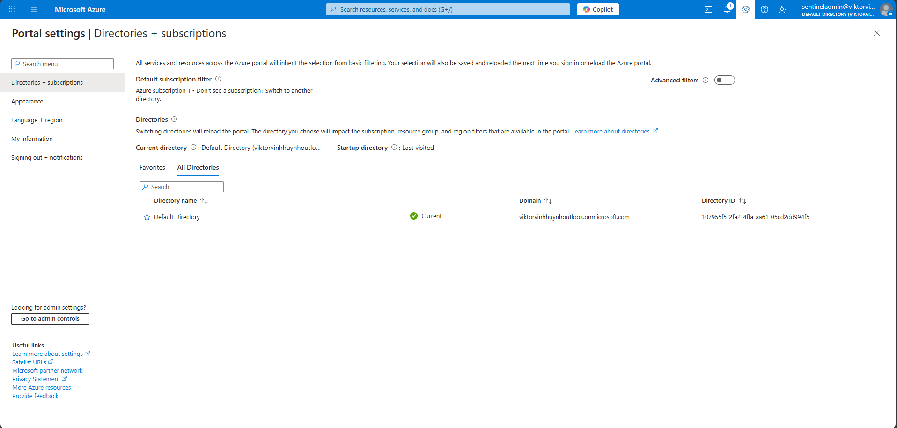

---

### Role-Based Access Control (RBAC)
Granted Contributor permissions at the subscription scope to enable Sentinel resource deployment.

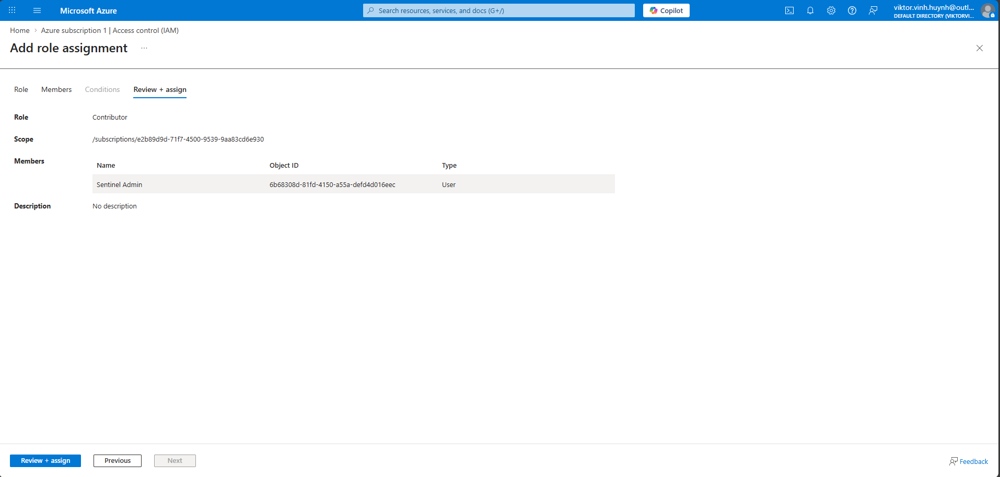

---

### Log Analytics Workspace Deployment
Created a dedicated Log Analytics Workspace to store security telemetry.

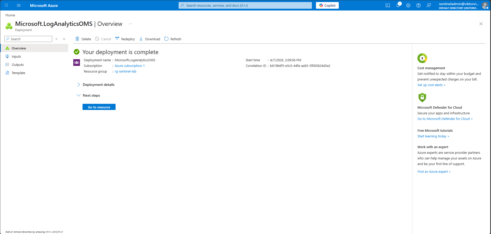

---

### Microsoft Sentinel Enabled
Enabled Microsoft Sentinel on the workspace.

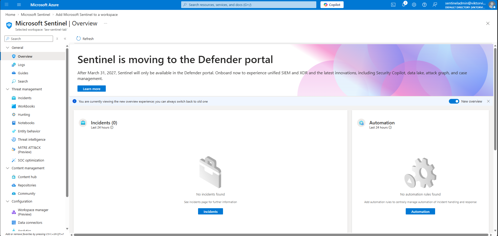

---

## Log Ingestion Configuration

### Entra ID Solution Deployment
Deployed the required Sentinel solution for Entra ID monitoring.

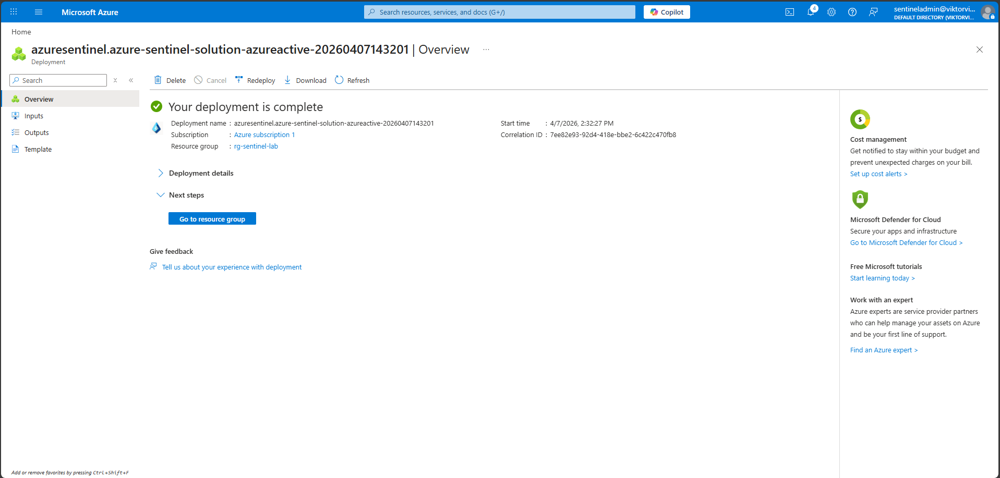

---

### Diagnostic Settings
Configured Entra ID diagnostic settings to forward SignInLogs and AuditLogs to Sentinel.

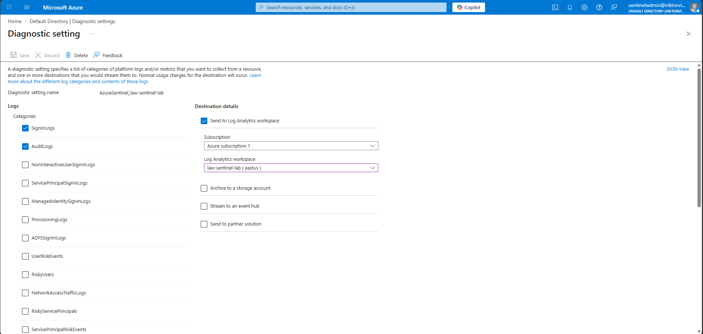

---

### Log Ingestion Validation
Confirmed successful ingestion of Entra ID sign‑in logs.

```kql
SigninLogs  
| take 5
```

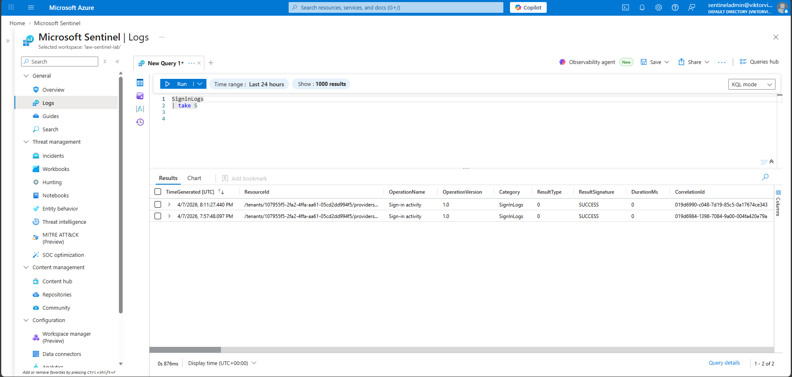

---

## Analytics Rule – Detection Engineering

### Detection Objective
Detect multiple failed Entra ID sign‑in attempts from the same user and IP address within a short time window, indicating potential brute‑force or credential stuffing activity.

---

### KQL Detection Logic

```kql
SigninLogs  
| where TimeGenerated > ago(30m)  
| where ResultType != 0  
| summarize FailedAttempts = count() by UserPrincipalName, IPAddress, bin(TimeGenerated, 10m)  
| where FailedAttempts >= 3
```

---

### Analytics Rule Configuration

- Rule Type: Scheduled query
- Severity: Medium
- MITRE ATT&CK Tactics:
  - Credential Access
  - Initial Access
- Schedule: Runs every 5 minutes
- Incident Creation: Enabled

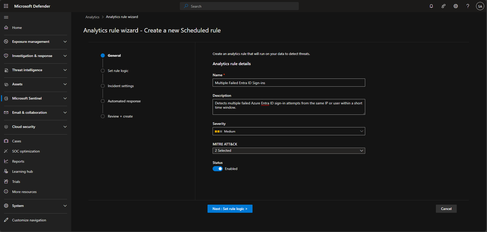
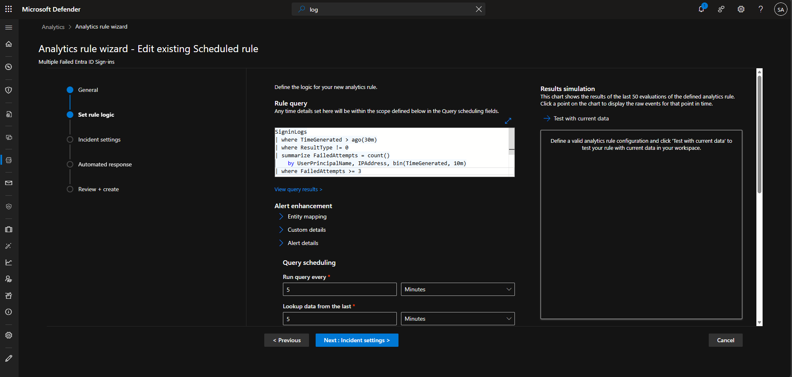

---

### Entity Mapping
Enabled entity mapping to enrich investigation context:

- Account → UserPrincipalName
- IP Address → IPAddress

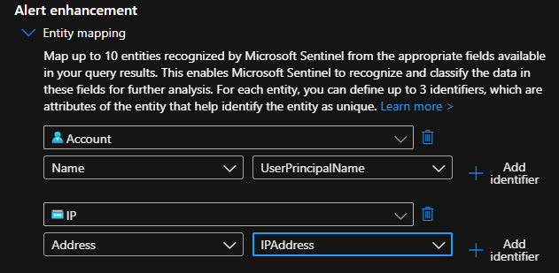

---

### Incident Settings
Configured analytics rule to create incidents from alerts.

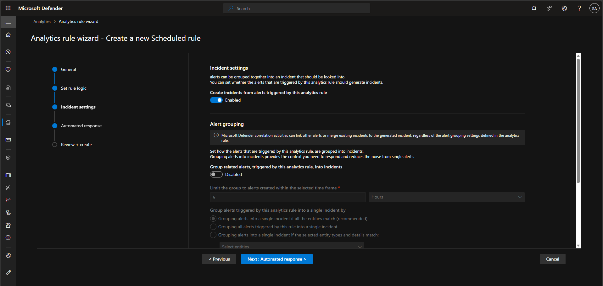

---

### Rule Enabled
Confirmed analytics rule status as Enabled.

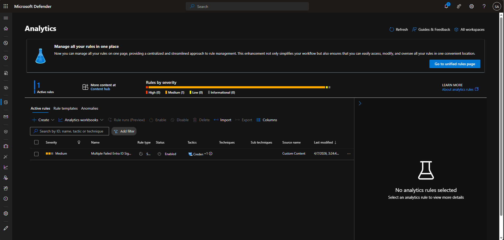

---

## Incident Generation and Investigation

Simulated repeated failed authentication attempts using a non‑privileged test account. The analytics rule successfully generated a Microsoft Sentinel incident, validating detection logic and SIEM functionality.

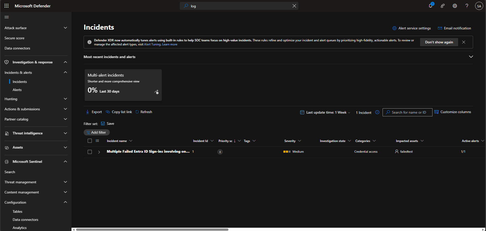

---

## Key Skills Demonstrated

- SIEM deployment and configuration
- Identity log ingestion and validation
- KQL query authoring and optimization
- Detection engineering
- Azure RBAC troubleshooting
- SOC-style incident investigation
- Microsoft Sentinel analytics tuning

---

## Lessons Learned

- Microsoft Sentinel analytics rules are schedule‑based, not real‑time
- Explicit time filtering is critical for KQL performance
- Sentinel managed identities require correct RBAC permissions
- Detection testing should use non‑administrative accounts to avoid lockouts

---

## Future Enhancements

- Add SOAR automation using Logic Apps
- Expand detections to include risky sign‑ins
- Build Sentinel Workbooks for visualization
- Integrate Microsoft Defender telemetry

---

## Author

Viktor Huynh  
Microsoft Sentinel SIEM Lab Project

---

## Disclaimer

This project was completed in a controlled lab environment for educational and portfolio purposes. Detection thresholds and configurations should be adjusted for production environments.
