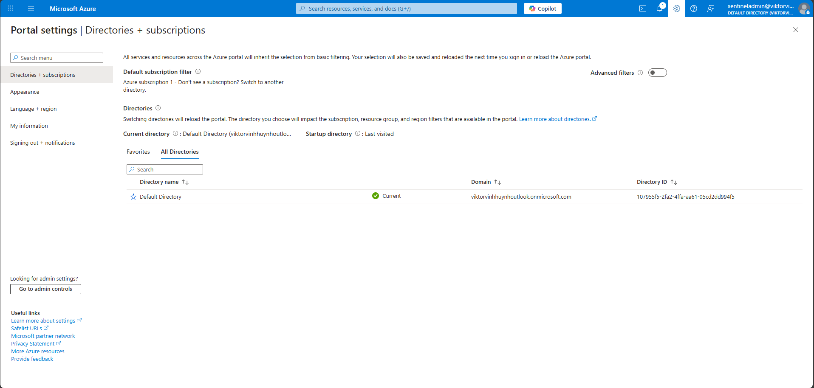
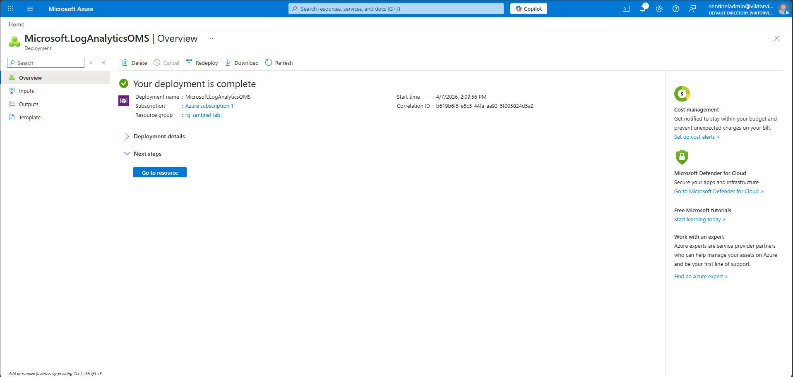
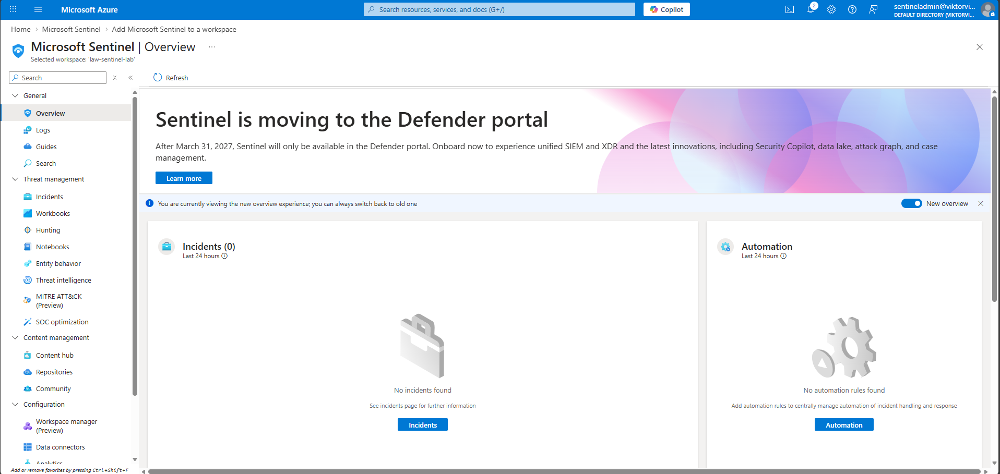
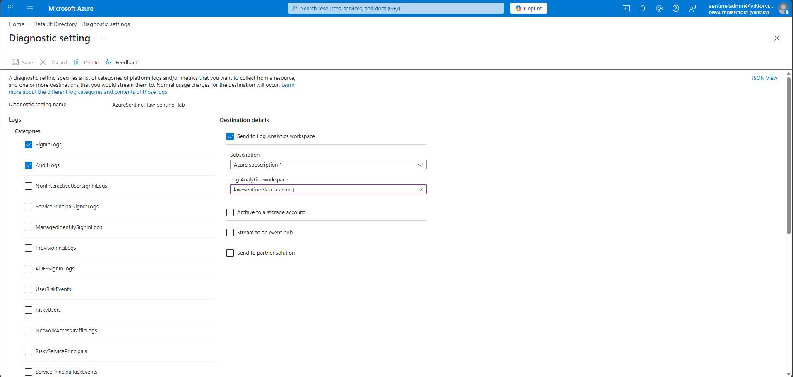
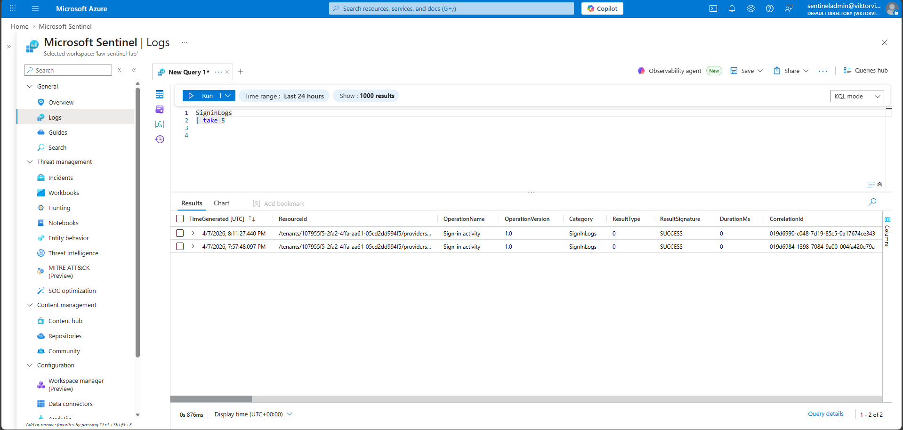
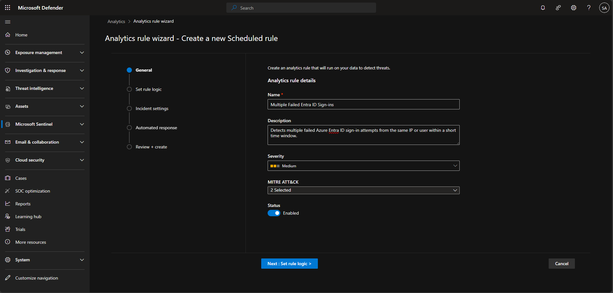
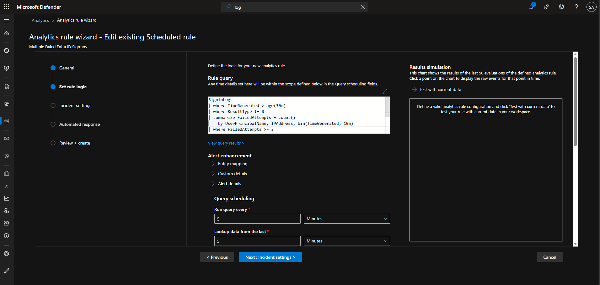
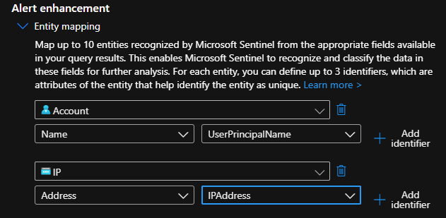
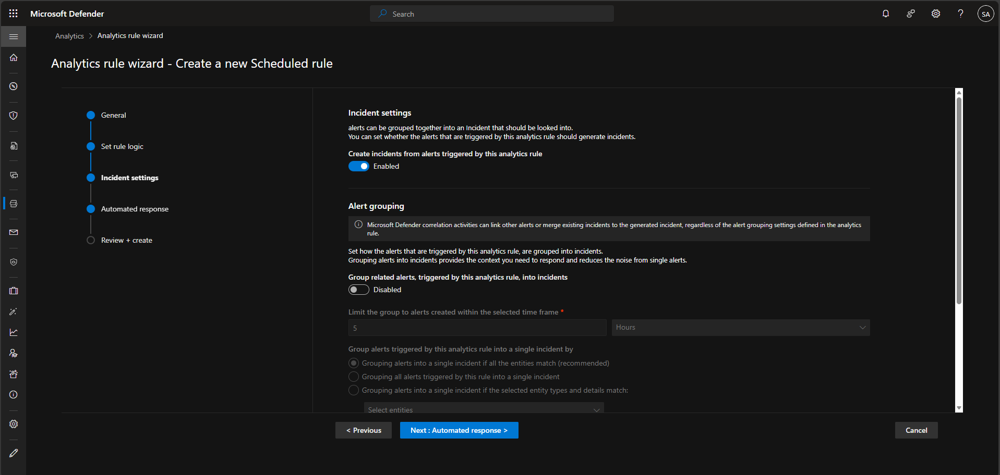
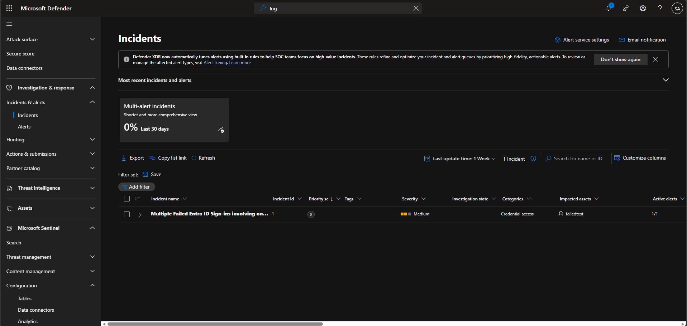

# Microsoft Sentinel — Entra ID Failed Sign-In Detection

> **SOC / Blue Team portfolio project:** built and validated an end-to-end Microsoft Sentinel detection for repeated failed Entra ID sign-ins.

## What this project proves

- Configuring Entra ID diagnostic settings and validating log ingestion in Log Analytics
- Writing and deploying a scheduled KQL analytics rule in Microsoft Sentinel
- Mapping account and IP entities for faster investigation
- Generating and reviewing a security incident from controlled test activity
- Applying basic detection-engineering thinking: scope, threshold, severity, tuning, and documentation

## Detection use case

**Objective:** identify repeated failed Entra ID sign-ins from the same user and IP address that may indicate password spraying, brute force, or credential-stuffing behavior.

**Data source:** `SigninLogs` forwarded from Microsoft Entra ID to a dedicated Log Analytics workspace.

**Detection:** [`detections/entra-id-failed-signins.kql`](detections/entra-id-failed-signins.kql)

| Configuration | Value |
|---|---|
| Rule type | Scheduled query |
| Lookback | 30 minutes |
| Query frequency | Every 5 minutes |
| Threshold | 3 failed attempts |
| Severity | Medium |
| Entity mapping | Account: `UserPrincipalName`; IP: `IPAddress` |
| Incident creation | Enabled |
| ATT&CK context | Credential Access / Initial Access |

> This is a lab threshold, not a production baseline. A production deployment should tune exclusions, alert grouping, suppression, and thresholds against normal user behavior.

## Architecture

```
Microsoft Entra ID
        ↓
Diagnostic settings (SigninLogs / AuditLogs)
        ↓
Log Analytics workspace
        ↓
Microsoft Sentinel
        ↓
Scheduled KQL analytics rule
        ↓
Alert and security incident
```

## Implementation and validation

### 1. Azure and Sentinel setup

- Verified the intended Azure tenant and subscription.
- Applied Contributor permissions at the subscription scope for resource deployment.
- Created a dedicated Log Analytics workspace and enabled Microsoft Sentinel.





### 2. Entra ID log ingestion

- Deployed the Entra ID Sentinel solution.
- Sent `SigninLogs` and `AuditLogs` to the workspace through diagnostic settings.
- Confirmed successful `SigninLogs` ingestion with KQL.

```kql
SigninLogs
| take 5
```




### 3. Detection engineering

The rule aggregates failed sign-ins by user, source IP, and 10-minute window. It then alerts once the threshold is met.






### 4. Controlled test and incident validation

A non-privileged test account generated repeated failed sign-ins. Sentinel created an incident, validating the full path from telemetry to investigation.



See the [incident walkthrough](docs/incident-walkthrough.md) for the analyst validation process.

## Skills demonstrated

Microsoft Sentinel · Microsoft Entra ID · Azure RBAC · Log Analytics · KQL · SIEM deployment · identity telemetry · alert triage · detection engineering · incident validation

## Lessons learned

- Sentinel scheduled analytics rules are not real-time detections.
- Explicit time filtering matters for KQL performance and predictable results.
- RBAC and managed-identity permissions can block otherwise correct deployments.
- Controlled testing with non-administrative accounts reduces the risk of accidental lockouts.
- A working rule still needs tuning before it is useful in production.

## Next improvements

- Add alert grouping and suppression to reduce repeated incident creation from overlapping lookback windows.
- Add detections for risky sign-ins and anomalous locations.
- Build a Sentinel workbook for authentication trends and investigation context.
- Integrate Microsoft Defender telemetry and document cross-source triage.

## Disclaimer

Completed in a controlled lab environment for educational and portfolio purposes. Detection thresholds and response procedures must be adjusted before production use.
